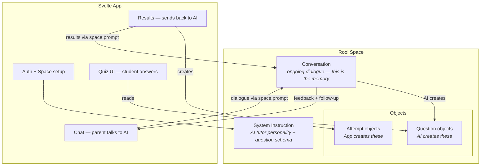
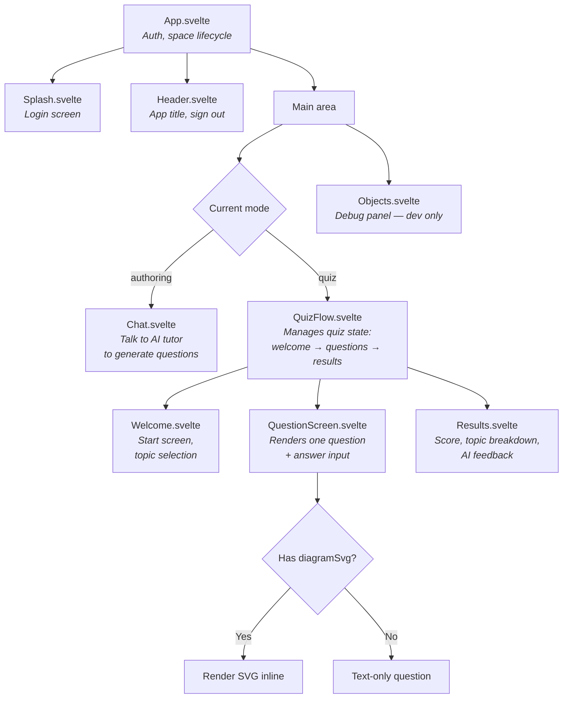
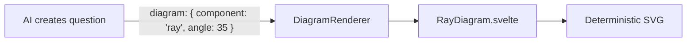
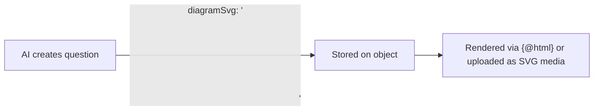
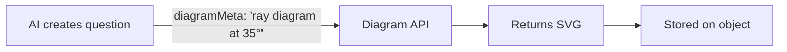
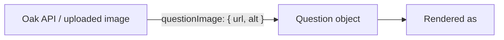
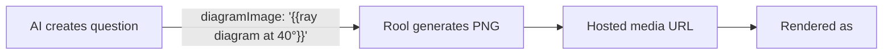

# Architecture

## How Rool Maps to the Tutoring App



## Data Model: Objects in the Space

All data lives as objects in a single Rool space. No external database.

The guiding principle: **only create object schemas the UI needs to parse deterministically.** Everything else — attempts, progress, feedback — lives in the conversation history. The AI can derive "what topics were weak" from chat context; we don't need to pre-compute it into objects.

### Question (contract: AI creates, quiz UI renders)

The system instruction tells the AI to create objects with this exact structure.

```typescript
{
  type: 'question',
  topic: 'Light',
  subtopic: 'Refraction',
  questionType: 'mc' | 'tf' | 'fill',
  question: 'When light passes from air into glass, it bends towards the normal. Why?',
  options: ['It speeds up', 'It slows down', 'It stays the same', 'It reflects'],  // mc only
  correctAnswer: 1,                    // index for mc, boolean for tf, string for fill
  acceptAlternatives: ['frequency'],   // fill only, optional
  acceptRange: [330, 343],             // fill only, optional
  explanation: 'Light slows down in a denser medium...',
  difficulty: 'foundation' | 'intermediate' | 'higher'
}
```

### Future question types: match and order

Oak National Academy's API uses four question types: `multiple-choice`, `short-answer`, `match`, and `order`. Our schema currently supports `mc`, `tf`, and `fill`. Two new types would extend coverage:

**Match** — student pairs items from two columns. Oak structure: array of `{ matchOption, correctChoice }` pairs.

```typescript
{
  type: 'question',
  questionType: 'match',
  question: 'Match each element to its chemical symbol',
  matchPairs: [
    { left: 'Sodium', right: 'Na' },
    { left: 'Potassium', right: 'K' },
    { left: 'Iron', right: 'Fe' },
    { left: 'Copper', right: 'Cu' }
  ],
  explanation: '...',
  // ... other standard fields
}
```

**Order** — student arranges items in the correct sequence. Oak structure: array of items with an `order` number.

```typescript
{
  type: 'question',
  questionType: 'order',
  question: 'Put these stages of ionic bonding in order',
  orderItems: [
    { content: 'Metal atom loses electron', order: 1 },
    { content: 'Non-metal atom gains electron', order: 2 },
    { content: 'Ions form with opposite charges', order: 3 },
    { content: 'Electrostatic attraction holds ions together', order: 4 }
  ],
  explanation: '...',
  // ... other standard fields
}
```

These are not built yet. Adding them means: new fields in `types.ts`, new input modes in `QuestionScreen.svelte`, new scoring logic in `checkAnswer.ts`. See [VISION.md — Oak National Academy](./VISION.md#oak-national-academy-open-api) for the broader integration story.

### Question images (not yet supported)

Oak's API attaches an optional image to any question type:

```typescript
{
  questionImage: {             // optional, on any question type
    url: 'https://...',
    width: 400,
    height: 300,
    alt: 'Diagram showing refraction of light through a glass block',
    attribution: '© Oak National Academy'
  }
}
```

Multiple-choice answers can also be images instead of text strings:

```typescript
{
  options: [
    { type: 'text', content: 'Answer A' },
    {
      type: 'image',
      content: { url: '...', alt: '...', width: 200, height: 150 },
    },
  ];
}
```

This is a simpler approach than the AI-generated SVG discussed in the Diagram Strategy section. For Oak-sourced questions, images are pre-made and hosted — just render an `` tag. For AI-generated questions, the diagram problem remains open. Both approaches could coexist: `questionImage` for hosted raster images, `diagramSvg` for AI-generated vector diagrams.

### Quiz (contract: AI creates after questions, quiz UI reads)

Groups questions into a named quiz. The AI creates one quiz object per generation round, referencing the question IDs it just created.

```typescript
{
  type: 'quiz',
  title: 'Year 8 Light and Sound',
  questionIds: ['id1', 'id2', ...],   // actual object IDs from createObject
  createdAt: 1709136000000
}
```

### Attempt (contract: app creates after quiz, AI reads for feedback)

Pure structured data. The app creates this after scoring, stamped with the student's identity from `rool.currentUser`. The AI reads it when asked for feedback or when generating follow-up quizzes.

```typescript
{
  type: 'attempt',
  quizId: 'iBaIt5',
  studentId: 'abc123',
  studentEmail: 'child@example.com',
  studentName: 'Alex',
  timestamp: 1709136000000,
  score: 13,
  total: 16,
  answers: [
    { questionId: 'q-abc', correct: true },
    { questionId: 'q-def', correct: false, given: 2, expected: 1 },
    ...
  ]
}
```

### Future fields (added when needed, not now)

- `diagramSvg` / `diagramMeta` on questions — for diagram support (see Diagram Strategy below)
- `status` on questions — for teacher review workflows
- `tags`, `targetMisconception` on questions — for richer metadata
- Progress / mastery objects — for structured aggregation beyond what the AI derives from attempts

## Component Map

### Planned (original design)



### What was actually built

- **Welcome.svelte** was not built. Topic selection happens in the Chat — the parent tells the AI what they want. This turned out to be more natural than a separate selection screen.
- **Diagrams** were not built (as planned — text-only for iteration 1).
- **Chat.svelte** renders AI responses as markdown (via `@humanspeak/svelte-markdown` + `@tailwindcss/typography`). This makes the chat a viable review surface — the parent can see formatted question summaries and tables without reading raw JSON.
- **QuizFlow.svelte** presents a quiz selection screen (the AI groups questions into named quiz objects), then runs the selected quiz.
- **Users.svelte** was built for multi-user management — add/remove users by email, link sharing toggle. Only visible to owners/admins.
- **Per-user conversations** — each user gets their own `conversationId` and AI system instruction. See [Conversations and System Instructions](#conversations-and-system-instructions).

## Diagram Strategy

Diagrams are important for science tutoring (ray diagrams, wave traces, oscilloscopes). The prototype had hand-crafted SVG components in React. For this app, there are five approaches we've evaluated. The rendering infrastructure now supports diagrams (`diagramImage` field on questions, rendered as `` in `QuestionScreen.svelte`), but the **generation strategy** is the open question.

### The core problem: two kinds of AI generation

Tested in iteration 2 with two approaches:

**AI image generation (Option E)** produced a ray diagram where the angle of incidence was labelled three times instead of once, a 50° angle was labelled as 40° (giving away the answer), and the arrows pointed the wrong direction. This is the "six fingers" problem — diffusion models don't reason about geometry, they interpolate pixel patterns.

**AI SVG generation (Option B)** produced a structurally correct transverse wave diagram with proper grid patterns, bezier curves, labelled dimensions, and arrow markers. However, the math was inconsistent — the stated wavelength (4cm) didn't match the actual wave geometry (which measured 2cm at the amplitude's scale). The structure was right; the numbers were wrong.

The key insight: **SVG generation is code generation, not image generation.** The AI writes coordinates, computes curves, and structures elements — it reasons mathematically rather than interpolating visuals. This makes it fundamentally more reliable than raster image generation, though it still makes mathematical errors that need review. The accuracy hierarchy is: parameterised components (guaranteed) > AI-generated SVG (structurally sound, math needs checking) > AI-generated raster (unreliable geometry).

### Option A: Parameterised diagram components

Build a library of Svelte components (`RayDiagram`, `WaveDiagram`, etc.) that accept props and render deterministic SVG. The AI picks a component and provides parameters.



**Pro**: Pixel-perfect, no review needed, fast rendering. The AI only has to get a *number* right (angle: 35), not draw geometry. Diagrams are guaranteed correct by construction.
**Con**: Limited to pre-built types. Adding a new diagram type = dev work. Doesn't scale to new subjects without building new components each time.

**Verdict**: The strongest option where precision matters — but only scales to a small library of high-frequency diagram types. Across subjects (physics, maths, biology, chemistry) and age ranges (7–17), the total number of useful diagram types grows quickly: ray diagrams, wave traces, oscilloscope traces, circuit diagrams, number lines, coordinate grids, bar models, fraction diagrams, geometry constructions, Venn diagrams, food webs, atomic structure... Building and maintaining a component for each is significant dev work. Best used as a "greatest hits" library for the diagram types that appear most often and where mathematical precision is non-negotiable, not as comprehensive coverage.

### Option B: AI generates SVG directly

The AI generates raw SVG markup as part of the question object. Stored as a string, rendered with `{@html}` (sanitised) or uploaded as an SVG media file. This worked well in the prototype (Claude generated JSX/SVG) and tested well in iteration 2.



**Pro**: Unlimited diagram types. Works for any subject. No component library to maintain. Because SVG generation is **code generation** (computing coordinates, writing markup) rather than image generation (interpolating pixels), the output is structurally sound — proper elements, correct curve types, appropriate use of patterns and markers. Crisp at any size. Editable.
**Con**: The AI can still get the **math wrong** — tested with a wave diagram where the stated wavelength (4cm) didn't match the actual geometry (2cm at the amplitude's scale). The structure was correct but the numbers were inconsistent. Needs review for mathematical accuracy. XSS risk with `{@html}` needs sanitisation (DOMPurify, or upload as SVG media file to render as ``).

**Verdict**: The most practical default for diagram generation across subjects and age ranges. As the app expands beyond physics to maths, biology, chemistry, and other subjects (ages 7–17), the number of potential diagram types grows faster than we can build parameterised components. B handles this naturally — the AI generates whatever SVG the question needs. The reviewer's job is checking "do the numbers match?" — not "is this recognisably a wave diagram?". With good prompting (answer-hiding rules, coordinate consistency, style guidelines), B can be the primary diagram approach, with A reserved for the highest-frequency precision-critical types. The XSS concern is solved by rendering SVG as blob URLs via `` (already implemented in `QuestionScreen.svelte`).

### Option C: External diagram API / isolated service

A separate service that takes a description like "ray diagram, 35° angle of incidence, mirror, normal line" and returns SVG.



**Pro**: Clean separation. Could be built as a specialised model/service later.
**Con**: Another moving part to build/maintain/pay for. Adds latency. Doesn't exist yet. If the service uses AI to generate the SVG, it has the same accuracy problems as Option B. If it uses parameterised templates, it's Option A with extra infrastructure.

**Verdict**: Doesn't solve the core problem unless the service itself uses deterministic rendering (at which point it's just Option A running remotely). Deferred.

### Option D: Hosted raster images (the Oak model)

Questions reference pre-made images by URL. No generation, no review — the image already exists. This is what Oak National Academy does: a `questionImage` field with `url`, `width`, `height`, `alt`.



**Pro**: Dead simple. No AI generation issues. No review needed. Works today.
**Con**: Only works for questions that already have images. Doesn't help when the AI generates a new question. Image coverage in Oak is inconsistent — many Chemistry lessons have no images at all.

**Verdict**: The right choice for Oak-sourced content. Already supported by the `diagramImage` field and `` rendering in `QuestionScreen`. No additional work needed — just populate the field with the hosted URL.

### Option E: AI-generated images via Rool's media pipeline

Rool's `{{placeholder}}` syntax in object fields can generate images. The AI creates a question with `diagramImage: '{{description of diagram}}'`, which resolves to a hosted PNG URL in Rool's media store.



**Pro**: Zero infrastructure — uses existing Rool primitives. No XSS risk (it's an `` tag). Unlimited diagram types. Works for any subject. Already tested and rendering in the app.
**Con**: **AI-generated images have the same geometric accuracy problem** — tested with a reflection diagram that had wrong angles, redundant labels (giving away the answer), and reversed arrows. Raster output means no editability and fuzzy at high resolution. Uses Rool credits. Adds latency to question creation.

**Verdict**: Useful for **illustrative, non-precision diagrams** — a labelled cell diagram, a concept map, a rough sketch to provide visual context. Not suitable for diagrams where spatial accuracy matters (angles, wavelengths, grid-based measurements). Already works with the current `diagramImage` rendering path.

### Revised strategy

The original prediction was D + B + A. After testing all five options, the revised strategy is **A + B + D + E** — a four-tier approach ordered by accuracy:

| Tier | Option | When to use | Accuracy | Status |
|------|--------|-------------|----------|--------|
| **Precision** | A — Parameterised components | Physics diagrams where numbers must match the visual (ray angles, wave measurements, oscilloscope readings) | Guaranteed correct | Not yet built |
| **Structured** | B — AI-generated SVG | Diagram types not covered by A, or subjects beyond physics. AI writes SVG code (coordinates, curves, labels) | Structurally sound, math needs review | Tested — AI produces good SVG structure but can get measurements wrong |
| **Pre-made** | D — Hosted images | Oak-sourced questions or manually uploaded images | Pre-vetted | Rendering works via `diagramImage` |
| **Illustrative** | E — AI-generated raster | Conceptual diagrams where approximate layout is fine (cell biology, concept maps, experimental setups) | Approximate — geometry unreliable | Rendering works via `diagramImage` |

The key finding from testing: **B and E are not equivalent.** AI SVG generation is code generation (mathematical, structural) while AI image generation is pixel interpolation (the "six fingers" problem). B produces correct diagram structure with occasional math errors; E produces diagrams with fundamental geometric errors (wrong angles, misplaced labels, reversed arrows).

### Cross-cutting concerns

#### Model dependency

SVG quality varies significantly between AI models. Testing showed that some models produce textbook-quality SVG (proper grid backgrounds, correct use of bezier curves, appropriate hatching and markers, correct answer-hiding with "?" labels) while others produce structurally correct but mathematically inconsistent output. The app's diagram quality is therefore partly at the mercy of whichever model the backend uses — and this can change without notice. The system instruction should compensate by being explicit about SVG quality expectations: coordinate consistency, label placement rules, and answer-hiding requirements.

#### Answer leakage in diagrams

All AI-generated diagram approaches (B and E) tend to **label the answer directly on the diagram** — defeating the point of the question. For example, a question asking "what is the amplitude?" accompanied by a diagram with "Amplitude (2cm)" labelled in red. This happened consistently across both raster and SVG generation until the prompt explicitly instructed the AI not to reveal the answer.

The system instruction must include rules like: "When a question asks the student to determine a value from a diagram, that value MUST NOT appear as a label. Use '?' or omit the label. The diagram should provide enough visual information (grid squares, scale markings) for the student to deduce the answer."

Option A avoids this problem structurally — the component controls what gets labelled, so a `WaveDiagram` component could accept `{ wavelength: 4, amplitude: 2, hideLabels: ['amplitude'] }` and the AI cannot accidentally give the answer away.

#### Review workflow for diagram questions

Text-only questions can be reviewed in the chat via markdown rendering. Diagram questions need the parent to **see the rendered diagram** before the child takes the quiz. The current chat shows AI responses as markdown, which doesn't render inline SVG or display referenced diagram objects. Options:

- Render diagram previews in the chat (requires markdown renderer extension or custom rendering for diagram fields)
- Add a "preview quiz" mode where the parent can see questions with diagrams before publishing
- Rely on the parent taking the quiz themselves first (already natural in the current flow)

For now, the parent-takes-quiz-first flow is sufficient. If diagram volume increases, a dedicated preview/approve step may be needed.

#### Token and credit economics

Rool credits are consumed by every AI operation. Diagram generation has significant cost implications:

| Approach | Credit cost per question | Notes |
|----------|------------------------|-------|
| **A — Parameterised** | Minimal | AI outputs a small JSON params object. No diagram generation cost. |
| **B — AI SVG** | Moderate–High | SVG markup is token-heavy (hundreds of tokens per diagram). Failed attempts cost credits too. |
| **D — Hosted images** | None | Image already exists. Just a URL reference. |
| **E — AI raster** | High | Image generation is expensive. Iteration ("regenerate that diagram") multiplies cost. |

There is no BYOK (bring your own key) option for Rool's AI — credit usage is governed by Rool's pricing. This makes Option A the most economical for high-volume question generation, and makes diagram iteration on B/E expensive. The system instruction should aim for first-attempt correctness to minimise regeneration.

#### Offline batch generation

The runtime cost and model dependency concerns can be sidestepped by generating diagrams **offline** — using a capable AI model outside of Rool (e.g., via a flat-rate subscription or API) to pre-generate SVGs or even parameterised component code, then importing the results into the app. This flips the economics: iteration is free, review happens at leisure, and the best-available model can be used regardless of what Rool's backend runs. An overnight batch session could produce a vetted library of SVG diagrams or Svelte components covering common question types across subjects, which the runtime AI then *references* rather than generates. This doesn't change the option taxonomy — it's a production strategy that makes A cheaper to build and B cheaper to populate.

### Revised strategy with cost and quality factors

| Tier | Option | When to use | Accuracy | Credit cost | Model sensitivity |
|------|--------|-------------|----------|-------------|-------------------|
| **Primary** | B — AI-generated SVG | Default for any question that needs a diagram, across all subjects and ages | Structurally sound, math needs review | Moderate–High | High — quality varies significantly between models |
| **Precision** | A — Parameterised components | High-frequency diagram types where mathematical precision is non-negotiable (oscilloscope traces, coordinate grids) | Guaranteed correct | Minimal | None — deterministic |
| **Pre-made** | D — Hosted images | Oak-sourced questions or manually uploaded images | Pre-vetted | None | None — pre-existing |
| **Illustrative** | E — AI-generated raster | Conceptual diagrams where approximate layout is fine and crispness doesn't matter | Approximate — geometry unreliable | High | High — diffusion model quality varies |

**B is the primary approach** because the app will span multiple subjects (physics, maths, biology, chemistry) and age ranges (7–17). The number of potential diagram types across that scope is too large for a component library to cover. B handles novel diagram types naturally — the AI generates whatever SVG the question needs. A is reserved for the small set of diagram types that appear so frequently and require such precision that guaranteed correctness justifies the dev investment.

**Next steps**:
1. Options B, D, and E already render — `QuestionScreen.svelte` handles media URLs, object ID references (for SVG objects), and direct `diagramSvg` strings, all rendered as `` via blob URLs (no XSS risk)
2. System instruction needs diagram-specific rules: answer-hiding ("use ? for the value the student must find"), coordinate consistency, style guidelines (clean lines, appropriate colours, grid backgrounds where measurements matter), and label placement. This is the highest-leverage improvement — better prompting improves every diagram B generates.
3. Option A as a "greatest hits" library: build components for the 3–5 most common precision-critical diagram types as usage patterns emerge. Don't pre-guess — let real question generation reveal which types need guaranteed correctness.
4. The question schema supports all tiers: `diagramImage` (URL or object ID — for B, D, and E), `diagramSvg` (string — for B inline), `diagram` (params — for A, not yet built). The renderer checks each in priority order A > B > D/E

## Quiz Grouping — Solved

Quizzes are now grouped using **quiz objects**. After creating question objects, the AI creates a `type: 'quiz'` object listing their IDs. QuizFlow presents a quiz selection screen, then runs the selected quiz's questions in order. See the [Quiz data model](#quiz-contract-ai-creates-after-questions-quiz-ui-reads) above.

## Tutor/Student Separation — Solved

Each user gets their own conversation within the shared space. The routing happens in `App.svelte` at space-open time based on role:

- **Owner/admin** → `conversationId: 'tutoring'` with `SYSTEM_INSTRUCTION` (quiz authoring persona)
- **Editor (student)** → `conversationId: 'student-<userId>'` with `STUDENT_INSTRUCTION` (friendly assistant persona)

This means:

- **Separate chat histories** — the parent and child never see each other's messages
- **Different AI personas** — the parent talks to a quiz-authoring tutor; the child talks to a warm, encouraging assistant
- **Shared objects** — questions, quizzes, and attempt results are visible to both (they're in the same space)
- **Different layouts** — admins see Chat + Objects side-by-side; students see Chat only (no Objects debug panel, no Users tab)

For full details including diagrams, see [USER-MANAGEMENT.md](./USER-MANAGEMENT.md).

Key design principles:

- **Question objects are the contract** — tutor creates them, student consumes them.
- **The chat IS the review surface** — with markdown rendering, the parent can see formatted questions in the chat without taking the quiz or reading JSON.
- **Attempt data is stamped with student identity** — `studentId`, `studentEmail`, `studentName` from `rool.currentUser`.

## Conversations and System Instructions

The space uses **multiple conversations** — one for the parent/tutor and one per student:

| Conversation         | Who           | System instruction    | Purpose                                                                     |
| -------------------- | ------------- | --------------------- | --------------------------------------------------------------------------- |
| `'tutoring'`         | Owner / Admin | `SYSTEM_INSTRUCTION`  | Quiz authoring — dialogue, question generation, quiz creation               |
| `'student-<userId>'` | Each student  | `STUDENT_INSTRUCTION` | Friendly assistant — welcomes student, gives quiz feedback, explains topics |

The **parent's system instruction** (`src/systemInstruction.ts`) defines the question and quiz object schemas, quality rules for distractors, and post-quiz feedback format.

The **student's system instruction** (`src/studentInstruction.ts`) creates a warm, encouraging persona that welcomes the student, explains they have quizzes to take, gives feedback after quizzes, and helps with topics — but **never creates objects** (that's the tutor's job).

Both conversations share the same space, so they see the same question/quiz/attempt objects. Only the chat history and AI persona differ.

## What's Built

- **Auth flow** (`App.svelte`): login → space creation/opening → role-based conversation routing
- **Chat** (`Chat.svelte`): send prompts, display interactions with markdown rendering, auto-scroll
- **Objects panel** (`Objects.svelte`): reactive collection showing all objects (admin only)
- **Header** (`Header.svelte`): mode toggle (Chat, Quiz, Users) with role-based tab visibility
- **Quiz flow** (`QuizFlow.svelte`): quiz selection → question screens → results with AI feedback
- **User management** (`Users.svelte`): add/remove users by email, link sharing (owner/admin only)
- **Per-user conversations**: role-based routing with separate AI personas for parent and student
