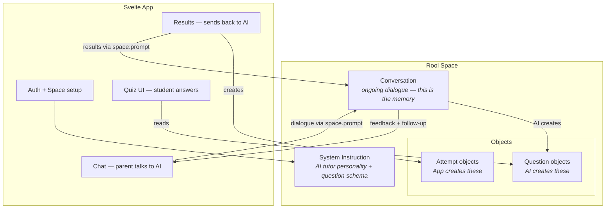
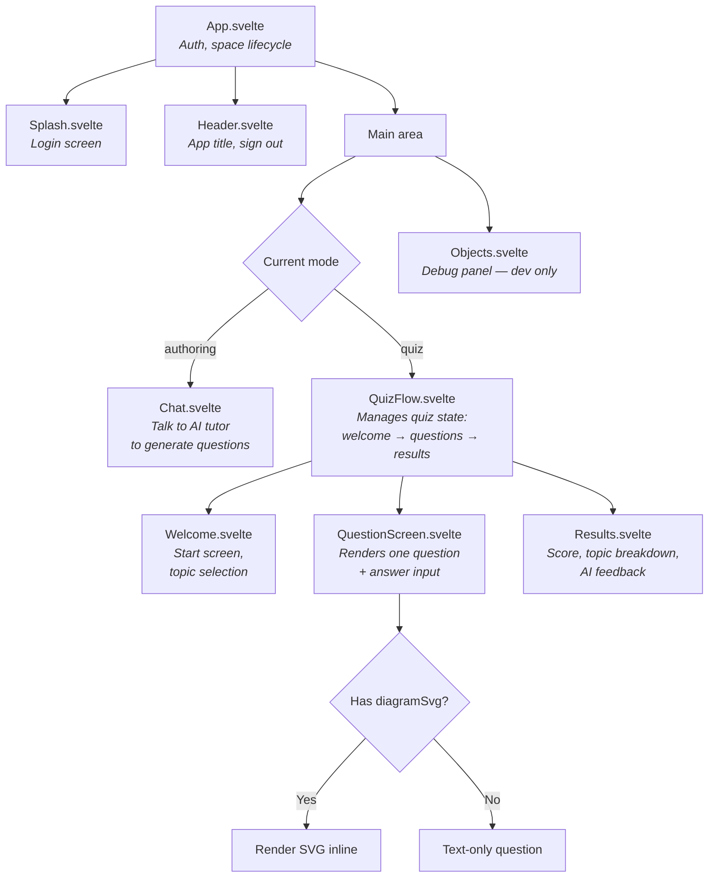

# Architecture

## How Rool Maps to the Tutoring App



## Data Model: Objects in the Space

All data lives as objects in a single Rool space. No external database.

The guiding principle: **only create object schemas the UI needs to parse deterministically.** Everything else — attempts, progress, feedback — lives in the conversation history. The AI can derive "what topics were weak" from chat context; we don't need to pre-compute it into objects.

### Question (contract: AI creates, quiz UI renders)

The system instruction tells the AI to create objects with this exact structure.

```typescript
{
  type: 'question',
  topic: 'Light',
  subtopic: 'Refraction',
  questionType: 'mc' | 'tf' | 'fill',
  question: 'When light passes from air into glass, it bends towards the normal. Why?',
  options: ['It speeds up', 'It slows down', 'It stays the same', 'It reflects'],  // mc only
  correctAnswer: 1,                    // index for mc, boolean for tf, string for fill
  acceptAlternatives: ['frequency'],   // fill only, optional
  acceptRange: [330, 343],             // fill only, optional
  explanation: 'Light slows down in a denser medium...',
  difficulty: 'foundation' | 'intermediate' | 'higher'
}
```

### Future question types: match and order

Oak National Academy's API uses four question types: `multiple-choice`, `short-answer`, `match`, and `order`. Our schema currently supports `mc`, `tf`, and `fill`. Two new types would extend coverage:

**Match** — student pairs items from two columns. Oak structure: array of `{ matchOption, correctChoice }` pairs.

```typescript
{
  type: 'question',
  questionType: 'match',
  question: 'Match each element to its chemical symbol',
  matchPairs: [
    { left: 'Sodium', right: 'Na' },
    { left: 'Potassium', right: 'K' },
    { left: 'Iron', right: 'Fe' },
    { left: 'Copper', right: 'Cu' }
  ],
  explanation: '...',
  // ... other standard fields
}
```

**Order** — student arranges items in the correct sequence. Oak structure: array of items with an `order` number.

```typescript
{
  type: 'question',
  questionType: 'order',
  question: 'Put these stages of ionic bonding in order',
  orderItems: [
    { content: 'Metal atom loses electron', order: 1 },
    { content: 'Non-metal atom gains electron', order: 2 },
    { content: 'Ions form with opposite charges', order: 3 },
    { content: 'Electrostatic attraction holds ions together', order: 4 }
  ],
  explanation: '...',
  // ... other standard fields
}
```

These are not built yet. Adding them means: new fields in `types.ts`, new input modes in `QuestionScreen.svelte`, new scoring logic in `checkAnswer.ts`. See [VISION.md — Oak National Academy](./VISION.md#oak-national-academy-open-api) for the broader integration story.

### Question diagrams

Questions can include diagrams via two fields:

- `diagramImage` — a Rool media URL, hosted image URL, or object ID referencing an `svg_diagram` object
- `diagramSvg` — a raw SVG markup string (inline on the question)

`QuestionScreen.svelte` resolves all three source types and renders them as blob URL `` tags (no XSS risk). See [Diagram Strategy](#diagram-strategy) for generation approaches.

Oak's API also attaches optional images to questions (`questionImage` with `url`, `width`, `height`, `alt`). These would map to `diagramImage` as a hosted URL — Option D in the diagram strategy.

### Quiz (contract: AI creates after questions, quiz UI reads)

Groups questions into a named quiz. The AI creates one quiz object per generation round, referencing the question IDs it just created.

```typescript
{
  type: 'quiz',
  title: 'Year 8 Light and Sound',
  questionIds: ['id1', 'id2', ...],   // actual object IDs from createObject
  createdAt: 1709136000000
}
```

### Attempt (contract: app creates after quiz, AI reads for feedback)

Pure structured data. The app creates this after scoring, stamped with the student's identity from `rool.currentUser`. The AI reads it when asked for feedback or when generating follow-up quizzes.

```typescript
{
  type: 'attempt',
  quizId: 'iBaIt5',
  studentId: 'abc123',
  studentEmail: 'child@example.com',
  studentName: 'Alex',
  timestamp: 1709136000000,
  score: 13,
  total: 16,
  answers: [
    { questionId: 'q-abc', correct: true },
    { questionId: 'q-def', correct: false, given: 2, expected: 1 },
    ...
  ]
}
```

### Future fields (added when needed, not now)

- `diagram` params on questions — for parameterised diagram components (Option A, not yet built)
- `status` on questions — for teacher review workflows
- `tags`, `targetMisconception` on questions — for richer metadata
- Progress / mastery objects — for structured aggregation beyond what the AI derives from attempts

## Component Map

### Planned (original design)



### What was actually built

- **Welcome.svelte** was not built. Topic selection happens in the Chat — the parent tells the AI what they want. This turned out to be more natural than a separate selection screen.
- **Diagrams** were built in iteration 2. `QuestionScreen.svelte` renders diagrams from three sources (SVG strings, media URLs, object ID references) as blob URL `` tags. The chat shows inline diagram previews via `ChatDiagramPreviews.svelte`. See [Diagram Strategy](#diagram-strategy).
- **Chat.svelte** renders AI responses as markdown (via `@humanspeak/svelte-markdown` + `@tailwindcss/typography`), with inline diagram previews for svg_diagram objects created during the interaction.
- **QuizFlow.svelte** presents a quiz selection screen (the AI groups questions into named quiz objects), then runs the selected quiz.
- **Users.svelte** was built for multi-user management — add/remove users by email, link sharing toggle. Only visible to owners/admins.
- **Per-user conversations** — each user gets their own `conversationId` and AI system instruction. See [Conversations and System Instructions](#conversations-and-system-instructions).

## Diagram Strategy

Diagrams are important for science tutoring (ray diagrams, wave traces, oscilloscopes) and increasingly for maths, biology, and other subjects as the app spans ages 7–17. Five approaches were evaluated; three are implemented.

### The core insight: SVG generation is code generation

AI image generation (raster/PNG) produces diagrams with fundamental geometric errors — wrong angles, misplaced labels, reversed arrows. This is the "six fingers" problem: diffusion models interpolate pixel patterns, they don't reason about geometry.

AI SVG generation produces structurally correct diagrams (proper curves, grid patterns, markers) but can get the **math wrong** (e.g., a stated wavelength of 4cm not matching the actual geometry). The structure is right; the numbers need checking.

**Accuracy hierarchy**: parameterised components (guaranteed) > AI-generated SVG (structurally sound, math needs checking) > AI-generated raster (unreliable geometry).

### Options evaluated

**A — Parameterised components.** Svelte components that accept props and render deterministic SVG. Guaranteed correct, but doesn't scale across subjects — the number of diagram types grows faster than we can build components. Best as a "greatest hits" library for precision-critical types. **Not yet built.**

**B — AI-generated SVG (primary approach).** The AI generates SVG markup stored as `svg_diagram` objects or inline `diagramSvg` strings. Rendered as blob URL `` tags (no XSS risk). Unlimited diagram types, works for any subject. Math needs review. **Built and working.**

**C — External diagram API.** Deferred. Just Option A or B with extra infrastructure.

**D — Hosted images.** Pre-made images referenced by URL (e.g., from Oak National Academy). No generation, no review needed. **Built — renders via `diagramImage`.**

**E — AI-generated raster via Rool's `{{placeholder}}` syntax.** Useful for illustrative, non-precision diagrams (cell biology, concept maps). Geometry unreliable, not editable, uses credits. **Built — renders via `diagramImage`.**

### Current strategy

| Tier             | Option                       | When to use                                                 | Accuracy                              | Credit cost   |
| ---------------- | ---------------------------- | ----------------------------------------------------------- | ------------------------------------- | ------------- |
| **Primary**      | B — AI-generated SVG         | Default for any diagram, across all subjects and ages       | Structurally sound, math needs review | Moderate–High |
| **Precision**    | A — Parameterised components | High-frequency types where math precision is non-negotiable | Guaranteed correct                    | Minimal       |
| **Pre-made**     | D — Hosted images            | Oak-sourced or manually uploaded images                     | Pre-vetted                            | None          |
| **Illustrative** | E — AI-generated raster      | Conceptual diagrams where approximate layout is fine        | Approximate                           | High          |

### Known issues and mitigations

**Answer leakage.** AI-generated diagrams consistently label the answer directly on the diagram unless explicitly told not to. The system instruction includes rules requiring `?` labels where the answer would go. Option A avoids this structurally.

**Model dependency.** SVG quality varies between AI models. The system instruction compensates with explicit SVG quality rules (coordinate consistency, label placement, style guidelines). The Rool backend model can change without notice.

**Token economics.** No BYOK for Rool credits. SVG is token-heavy. The system instruction aims for first-attempt correctness. Offline batch generation (using a capable model outside Rool to pre-generate SVGs) can sidestep runtime costs.

**Review workflow.** `ChatDiagramPreviews.svelte` renders inline diagram previews in the chat after the AI creates `svg_diagram` objects. The Objects panel also shows rendered SVG previews. The parent can review diagrams without leaving the chat or taking the quiz.

### What's left

- Option A "greatest hits" library: build components for 3–5 precision-critical diagram types as usage patterns emerge
- Continued prompting refinement for SVG quality (text overflow, coordinate consistency)

## Quiz Grouping — Solved

Quizzes are now grouped using **quiz objects**. After creating question objects, the AI creates a `type: 'quiz'` object listing their IDs. QuizFlow presents a quiz selection screen, then runs the selected quiz's questions in order. See the [Quiz data model](#quiz-contract-ai-creates-after-questions-quiz-ui-reads) above.

## Tutor/Student Separation — Solved

Each user gets their own conversation within the shared space. The routing happens in `App.svelte` at space-open time based on role:

- **Owner/admin** → `conversationId: 'tutoring'` with `SYSTEM_INSTRUCTION` (quiz authoring persona)
- **Editor (student)** → `conversationId: 'student-<userId>'` with `STUDENT_INSTRUCTION` (friendly assistant persona)

This means:

- **Separate chat histories** — the parent and child never see each other's messages
- **Different AI personas** — the parent talks to a quiz-authoring tutor; the child talks to a warm, encouraging assistant
- **Shared objects** — questions, quizzes, and attempt results are visible to both (they're in the same space)
- **Different layouts** — admins see Chat + Objects side-by-side; students see Chat only (no Objects debug panel, no Users tab)

For full details including diagrams, see [USER-MANAGEMENT.md](./USER-MANAGEMENT.md).

Key design principles:

- **Question objects are the contract** — tutor creates them, student consumes them.
- **The chat IS the review surface** — with markdown rendering, the parent can see formatted questions in the chat without taking the quiz or reading JSON.
- **Attempt data is stamped with student identity** — `studentId`, `studentEmail`, `studentName` from `rool.currentUser`.

## Conversations and System Instructions

The space uses **multiple conversations** — one for the parent/tutor and one per student:

| Conversation         | Who           | System instruction    | Purpose                                                                     |
| -------------------- | ------------- | --------------------- | --------------------------------------------------------------------------- |
| `'tutoring'`         | Owner / Admin | `SYSTEM_INSTRUCTION`  | Quiz authoring — dialogue, question generation, quiz creation               |
| `'student-<userId>'` | Each student  | `STUDENT_INSTRUCTION` | Friendly assistant — welcomes student, gives quiz feedback, explains topics |

The **parent's system instruction** (`src/systemInstruction.ts`) defines the question and quiz object schemas, quality rules for distractors, and post-quiz feedback format.

The **student's system instruction** (`src/studentInstruction.ts`) creates a warm, encouraging persona that welcomes the student, explains they have quizzes to take, gives feedback after quizzes, and helps with topics — but **never creates objects** (that's the tutor's job).

Both conversations share the same space, so they see the same question/quiz/attempt objects. Only the chat history and AI persona differ.

## What's Built

- **Auth flow** (`App.svelte`): login → space creation/opening → role-based conversation routing
- **Chat** (`Chat.svelte`): send prompts, display interactions with markdown rendering, auto-scroll, inline diagram previews
- **Objects panel** (`Objects.svelte`): reactive collection with type-grouped views (quiz, question, svg_diagram, attempt), rendered SVG previews
- **Header** (`Header.svelte`): mode toggle (Chat, Quiz, Users) with role-based tab visibility
- **Quiz flow** (`QuizFlow.svelte`): quiz selection → question screens (with diagram rendering) → results with AI feedback
- **Diagrams**: three rendering paths (SVG strings, media URLs, object ID references), all via blob URL `` tags; inline chat previews; system instruction with SVG quality rules
- **User management** (`Users.svelte`): add/remove users by email, link sharing (owner/admin only)
- **Per-user conversations**: role-based routing with separate AI personas for parent and student
