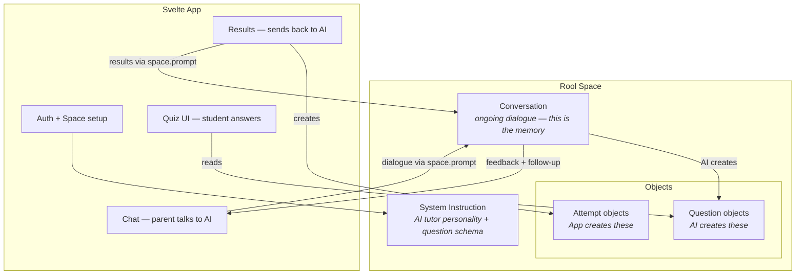
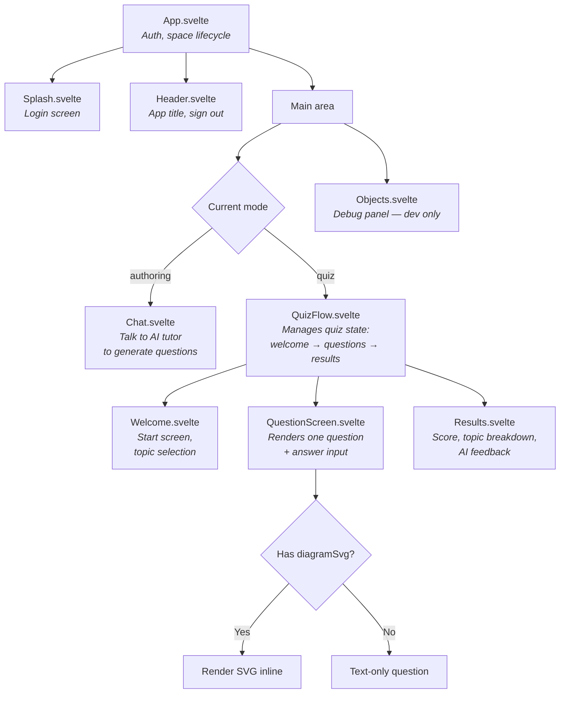
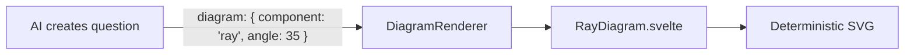
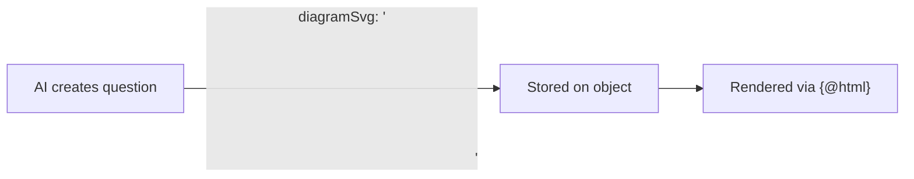
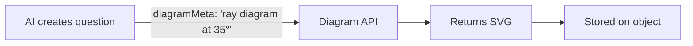
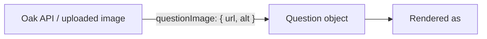

# Architecture

## How Rool Maps to the Tutoring App



## Data Model: Objects in the Space

All data lives as objects in a single Rool space. No external database.

The guiding principle: **only create object schemas the UI needs to parse deterministically.** Everything else — attempts, progress, feedback — lives in the conversation history. The AI can derive "what topics were weak" from chat context; we don't need to pre-compute it into objects.

### Question (contract: AI creates, quiz UI renders)

The system instruction tells the AI to create objects with this exact structure.

```typescript
{
  type: 'question',
  topic: 'Light',
  subtopic: 'Refraction',
  questionType: 'mc' | 'tf' | 'fill',
  question: 'When light passes from air into glass, it bends towards the normal. Why?',
  options: ['It speeds up', 'It slows down', 'It stays the same', 'It reflects'],  // mc only
  correctAnswer: 1,                    // index for mc, boolean for tf, string for fill
  acceptAlternatives: ['frequency'],   // fill only, optional
  acceptRange: [330, 343],             // fill only, optional
  explanation: 'Light slows down in a denser medium...',
  difficulty: 'foundation' | 'intermediate' | 'higher'
}
```

### Future question types: match and order

Oak National Academy's API uses four question types: `multiple-choice`, `short-answer`, `match`, and `order`. Our schema currently supports `mc`, `tf`, and `fill`. Two new types would extend coverage:

**Match** — student pairs items from two columns. Oak structure: array of `{ matchOption, correctChoice }` pairs.

```typescript
{
  type: 'question',
  questionType: 'match',
  question: 'Match each element to its chemical symbol',
  matchPairs: [
    { left: 'Sodium', right: 'Na' },
    { left: 'Potassium', right: 'K' },
    { left: 'Iron', right: 'Fe' },
    { left: 'Copper', right: 'Cu' }
  ],
  explanation: '...',
  // ... other standard fields
}
```

**Order** — student arranges items in the correct sequence. Oak structure: array of items with an `order` number.

```typescript
{
  type: 'question',
  questionType: 'order',
  question: 'Put these stages of ionic bonding in order',
  orderItems: [
    { content: 'Metal atom loses electron', order: 1 },
    { content: 'Non-metal atom gains electron', order: 2 },
    { content: 'Ions form with opposite charges', order: 3 },
    { content: 'Electrostatic attraction holds ions together', order: 4 }
  ],
  explanation: '...',
  // ... other standard fields
}
```

These are not built yet. Adding them means: new fields in `types.ts`, new input modes in `QuestionScreen.svelte`, new scoring logic in `checkAnswer.ts`. See [VISION.md — Oak National Academy](./VISION.md#oak-national-academy-open-api) for the broader integration story.

### Question images (not yet supported)

Oak's API attaches an optional image to any question type:

```typescript
{
  questionImage: {             // optional, on any question type
    url: 'https://...',
    width: 400,
    height: 300,
    alt: 'Diagram showing refraction of light through a glass block',
    attribution: '© Oak National Academy'
  }
}
```

Multiple-choice answers can also be images instead of text strings:

```typescript
{
  options: [
    { type: 'text', content: 'Answer A' },
    {
      type: 'image',
      content: { url: '...', alt: '...', width: 200, height: 150 },
    },
  ];
}
```

This is a simpler approach than the AI-generated SVG discussed in the Diagram Strategy section. For Oak-sourced questions, images are pre-made and hosted — just render an `` tag. For AI-generated questions, the diagram problem remains open. Both approaches could coexist: `questionImage` for hosted raster images, `diagramSvg` for AI-generated vector diagrams.

### Quiz (contract: AI creates after questions, quiz UI reads)

Groups questions into a named quiz. The AI creates one quiz object per generation round, referencing the question IDs it just created.

```typescript
{
  type: 'quiz',
  title: 'Year 8 Light and Sound',
  questionIds: ['id1', 'id2', ...],   // actual object IDs from createObject
  createdAt: 1709136000000
}
```

### Attempt (contract: app creates after quiz, AI reads for feedback)

Pure structured data. The app creates this after scoring, stamped with the student's identity from `rool.currentUser`. The AI reads it when asked for feedback or when generating follow-up quizzes.

```typescript
{
  type: 'attempt',
  quizId: 'iBaIt5',
  studentId: 'abc123',
  studentEmail: 'child@example.com',
  studentName: 'Alex',
  timestamp: 1709136000000,
  score: 13,
  total: 16,
  answers: [
    { questionId: 'q-abc', correct: true },
    { questionId: 'q-def', correct: false, given: 2, expected: 1 },
    ...
  ]
}
```

### Future fields (added when needed, not now)

- `diagramSvg` / `diagramMeta` on questions — for diagram support (see Diagram Strategy below)
- `status` on questions — for teacher review workflows
- `tags`, `targetMisconception` on questions — for richer metadata
- Progress / mastery objects — for structured aggregation beyond what the AI derives from attempts

## Component Map

### Planned (original design)



### What was actually built

- **Welcome.svelte** was not built. Topic selection happens in the Chat — the parent tells the AI what they want. This turned out to be more natural than a separate selection screen.
- **Diagrams** were not built (as planned — text-only for iteration 1).
- **Chat.svelte** renders AI responses as markdown (via `@humanspeak/svelte-markdown` + `@tailwindcss/typography`). This makes the chat a viable review surface — the parent can see formatted question summaries and tables without reading raw JSON.
- **QuizFlow.svelte** presents a quiz selection screen (the AI groups questions into named quiz objects), then runs the selected quiz.
- **Users.svelte** was built for multi-user management — add/remove users by email, link sharing toggle. Only visible to owners/admins.
- **Per-user conversations** — each user gets their own `conversationId` and AI system instruction. See [Conversations and System Instructions](#conversations-and-system-instructions).

## Diagram Strategy — Decision Not Yet Made

Diagrams are important for science tutoring (ray diagrams, wave traces, oscilloscopes). The prototype had hand-crafted SVG components in React. For this app, there are three viable approaches. **We're not picking one yet** — iteration 1 ships with text-only questions, and we'll learn from real usage which approach fits.

### Option A: Parameterised diagram components

Build a library of Svelte components (`RayDiagram`, `WaveDiagram`, etc.) that accept props and render deterministic SVG. The AI picks a component and provides parameters.



**Pro**: Pixel-perfect, no review needed, fast rendering.
**Con**: Limited to pre-built types. Adding a new diagram type = dev work. Doesn't scale to new subjects without building new components each time.

### Option B: AI generates SVG directly

The AI generates raw SVG markup as part of the question object. Stored as a string, rendered with `{@html}`. This is what worked in the prototype — Claude generated the JSX/SVG and it was reviewed visually.



**Pro**: Unlimited diagram types. Works for any subject. No component library to maintain.
**Con**: AI-generated SVG can be subtly wrong (coordinates, labels, angles). Needs review — but the review is visual ("does this look right?"), not technical. XSS risk with `{@html}` needs sanitisation.

The key question: **who reviews?** For a technical parent (like you), glancing at the rendered diagram is enough. For a non-technical teacher, they need a clear preview with an explicit "approve this diagram" step. For a student with no reviewer... we'd need to trust the AI or skip diagrams.

### Option C: External diagram API / isolated service

A separate service (could be self-hosted, third-party, or another AI call) that takes a description like "ray diagram, 35° angle of incidence, mirror, normal line" and returns SVG. The quiz app just consumes the output.



**Pro**: Clean separation. Could be built as a specialised model/service later. Keeps the quiz app simple.
**Con**: Another moving part to build/maintain/pay for. Adds latency to question generation. Doesn't exist yet.

### Option D: Hosted raster images (the Oak model)

Questions reference pre-made images by URL. No generation, no review — the image already exists. This is what Oak National Academy does: a `questionImage` field with `url`, `width`, `height`, `alt`.



**Pro**: Dead simple. No AI generation issues. No review needed. Works today.
**Con**: Only works for questions that already have images. Doesn't help when the AI generates a new question about a concept that needs a diagram. Image coverage in Oak is inconsistent — many Chemistry lessons have no images at all.

### What we're doing now

**Nothing.** Iteration 1 is text-only. The question schema has `diagramSvg` and `diagramMeta` fields ready, but the quiz UI won't render them yet. This is deliberate — we want to validate the tutoring loop before investing in diagrams.

When we do tackle diagrams, we'll probably end up with a mix: Option D (hosted images) for Oak-sourced questions and any uploaded images; Option B (AI-generated SVG) for AI-created questions that need visuals; Option A (parameterised components) for diagram types that must be mathematically precise (oscilloscope readings where students calculate frequency from the trace — the numbers must match the visual).

## Quiz Grouping — Solved

Quizzes are now grouped using **quiz objects**. After creating question objects, the AI creates a `type: 'quiz'` object listing their IDs. QuizFlow presents a quiz selection screen, then runs the selected quiz's questions in order. See the [Quiz data model](#quiz-contract-ai-creates-after-questions-quiz-ui-reads) above.

## Tutor/Student Separation — Solved

Each user gets their own conversation within the shared space. The routing happens in `App.svelte` at space-open time based on role:

- **Owner/admin** → `conversationId: 'tutoring'` with `SYSTEM_INSTRUCTION` (quiz authoring persona)
- **Editor (student)** → `conversationId: 'student-<userId>'` with `STUDENT_INSTRUCTION` (friendly assistant persona)

This means:

- **Separate chat histories** — the parent and child never see each other's messages
- **Different AI personas** — the parent talks to a quiz-authoring tutor; the child talks to a warm, encouraging assistant
- **Shared objects** — questions, quizzes, and attempt results are visible to both (they're in the same space)
- **Different layouts** — admins see Chat + Objects side-by-side; students see Chat only (no Objects debug panel, no Users tab)

For full details including diagrams, see [USER-MANAGEMENT.md](./USER-MANAGEMENT.md).

Key design principles:

- **Question objects are the contract** — tutor creates them, student consumes them.
- **The chat IS the review surface** — with markdown rendering, the parent can see formatted questions in the chat without taking the quiz or reading JSON.
- **Attempt data is stamped with student identity** — `studentId`, `studentEmail`, `studentName` from `rool.currentUser`.

## Conversations and System Instructions

The space uses **multiple conversations** — one for the parent/tutor and one per student:

| Conversation         | Who           | System instruction    | Purpose                                                                     |
| -------------------- | ------------- | --------------------- | --------------------------------------------------------------------------- |
| `'tutoring'`         | Owner / Admin | `SYSTEM_INSTRUCTION`  | Quiz authoring — dialogue, question generation, quiz creation               |
| `'student-<userId>'` | Each student  | `STUDENT_INSTRUCTION` | Friendly assistant — welcomes student, gives quiz feedback, explains topics |

The **parent's system instruction** (`src/systemInstruction.ts`) defines the question and quiz object schemas, quality rules for distractors, and post-quiz feedback format.

The **student's system instruction** (`src/studentInstruction.ts`) creates a warm, encouraging persona that welcomes the student, explains they have quizzes to take, gives feedback after quizzes, and helps with topics — but **never creates objects** (that's the tutor's job).

Both conversations share the same space, so they see the same question/quiz/attempt objects. Only the chat history and AI persona differ.

## What's Built

- **Auth flow** (`App.svelte`): login → space creation/opening → role-based conversation routing
- **Chat** (`Chat.svelte`): send prompts, display interactions with markdown rendering, auto-scroll
- **Objects panel** (`Objects.svelte`): reactive collection showing all objects (admin only)
- **Header** (`Header.svelte`): mode toggle (Chat, Quiz, Users) with role-based tab visibility
- **Quiz flow** (`QuizFlow.svelte`): quiz selection → question screens → results with AI feedback
- **User management** (`Users.svelte`): add/remove users by email, link sharing (owner/admin only)
- **Per-user conversations**: role-based routing with separate AI personas for parent and student
