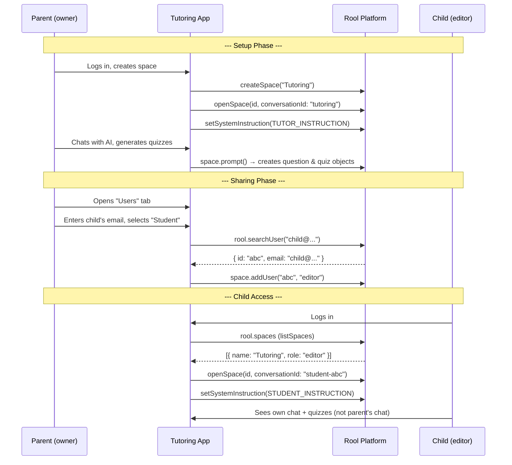
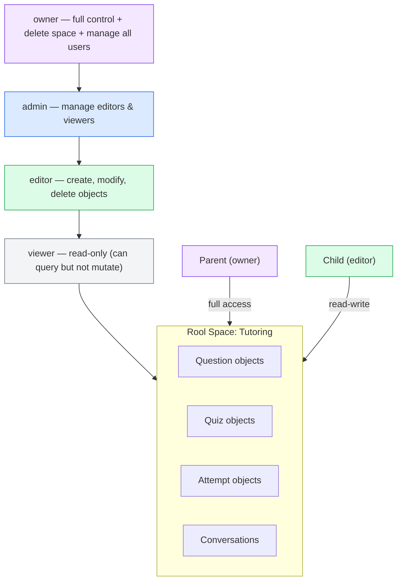
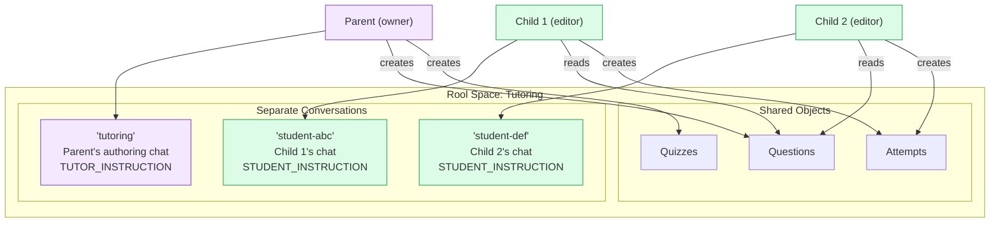
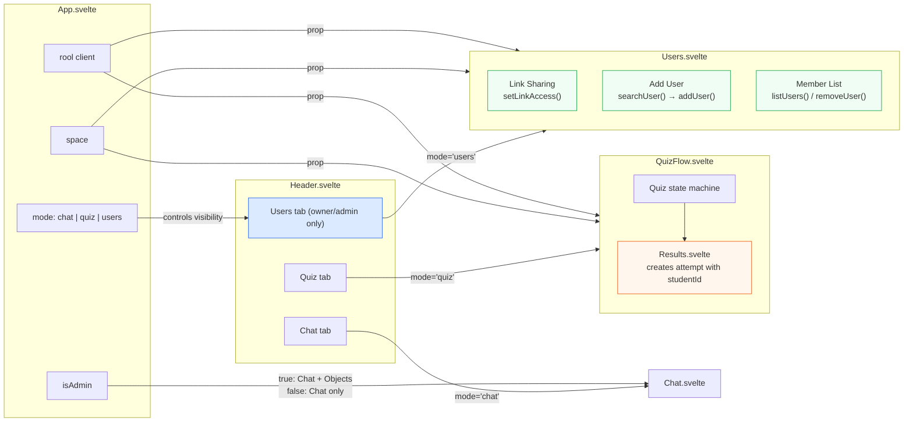
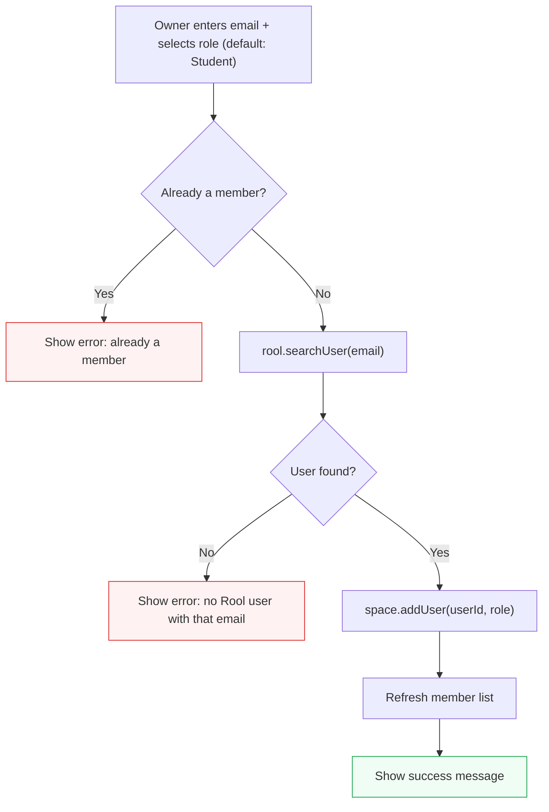

# User Management in the Tutoring App

## The Problem

Rool spaces are **user-scoped by default**. When a new user logs into a Rool app, they only see spaces they own or have been explicitly added to. There is no automatic "app-level" sharing -- if a parent creates a space full of quizzes, their child logging in sees an empty space unless the parent grants access.

Rool provides SDK methods for user management (`searchUser`, `addUser`, `removeUser`, `listUsers`, `setLinkAccess`) but **no built-in UI** for any of it. The app must provide its own.

## How It Works



## Rool's Role Model

Access control is **space-level only** -- if you can access a space, you see all objects in it. There are no object-level permissions.



**Why editor, not viewer?** Students need the `editor` role because `Results.svelte` calls `space.createObject()` to store quiz attempts and `space.prompt()` to get AI feedback. Viewers cannot perform mutations.

## Per-User Conversations

Each user gets their own conversation within the shared space. This means separate chat histories and separate AI instructions, while all users see the same quiz/question objects.



The conversation routing happens in `App.svelte` at space-open time:

- **Owner/admin** → `conversationId: 'tutoring'` with `SYSTEM_INSTRUCTION` (quiz authoring)
- **Editor (student)** → `conversationId: 'student-<userId>'` with `STUDENT_INSTRUCTION` (friendly assistant)

## Two Ways to Share

| Method       | SDK Call                                                | Who Gets Access                |
| ------------ | ------------------------------------------------------- | ------------------------------ |
| **By email** | `rool.searchUser(email)` then `space.addUser(id, role)` | One specific Rool user         |
| **By link**  | `space.setLinkAccess('viewer' \| 'editor')`             | Anyone who opens the space URL |

## Component Architecture

The Users tab is only visible to owners and admins. Students see Chat and Quiz only.



## The Add-User Flow



## SDK Methods Used

| Method                             | Level  | Purpose                                                                |
| ---------------------------------- | ------ | ---------------------------------------------------------------------- |
| `rool.searchUser(email)`           | Client | Look up a Rool user by email. Returns `{ id, email, name }` or `null`. |
| `space.addUser(userId, role)`      | Space  | Grant a user access with a specific role.                              |
| `space.removeUser(userId)`         | Space  | Revoke a user's access.                                                |
| `space.listUsers()`                | Space  | List all members. Returns `{ id, email, role }[]`.                     |
| `space.setLinkAccess(access)`      | Space  | Set public link access: `'none'`, `'viewer'`, or `'editor'`.           |
| `space.role`                       | Space  | Current user's role in this space.                                     |
| `space.setSystemInstruction(text)` | Space  | Set AI instruction for the current conversation.                       |

## What This Means for the Tutoring App

The parent (space owner) manages access through the Users tab:

1. **Add the child as a Student (editor)** -- they get their own private chat with a friendly AI assistant, can take quizzes, and receive personalised feedback
2. **Add a co-parent or tutor as an Admin** -- they see the authoring chat and can create quiz content
3. **Use link sharing for quick access** -- set to `editor` and share the URL

The student's experience:

- Gets their **own conversation** with a warm, encouraging AI assistant
- Does **not** see the parent's authoring chat or the Objects debug panel
- The **Users tab is hidden** (only owner/admin can manage users)
- Can take quizzes and receive AI feedback in their own chat
- Quiz results are stored as attempt objects (shared in the space, visible to parent)

## Attempt Object Data Model

When a student completes a quiz, `Results.svelte` creates an attempt object stamped with the student's identity:

```json
{
  "type": "attempt",
  "quizId": "iBaIt5",
  "studentId": "abc123",
  "studentEmail": "child@example.com",
  "studentName": "Alex",
  "timestamp": 1709136000000,
  "score": 13,
  "total": 16,
  "answers": [
    { "questionId": "q1", "correct": true },
    { "questionId": "q2", "correct": false, "given": 2, "expected": 1 }
  ]
}
```

The `studentId`, `studentEmail`, and `studentName` fields come from `rool.currentUser`, which is threaded through `App → QuizFlow → Results`.

## Files

| File                        | Purpose                                                                                                                |
| --------------------------- | ---------------------------------------------------------------------------------------------------------------------- |
| `src/App.svelte`            | Role-based conversation routing, passes `rool` to QuizFlow and Users, layout (admin: Chat+Objects, student: Chat only) |
| `src/Header.svelte`         | Mode toggle with "Users" tab guarded by `space.role`                                                                   |
| `src/Users.svelte`          | User management UI -- member list, add user form (defaults to Student/editor), link sharing toggle                     |
| `src/QuizFlow.svelte`       | Quiz state machine -- accepts and forwards `rool` to Results                                                           |
| `src/Results.svelte`        | Stamps attempt objects with `studentId`, `studentEmail`, `studentName` from `rool.currentUser`                         |
| `src/studentInstruction.ts` | AI system instruction for the student experience                                                                       |
| `src/systemInstruction.ts`  | AI system instruction for the parent/tutor authoring experience                                                        |
