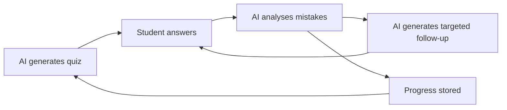
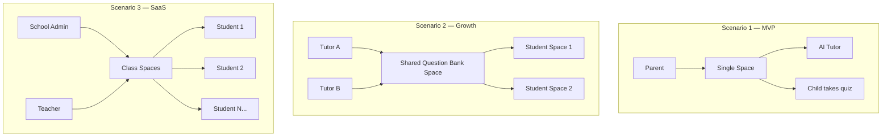
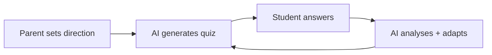
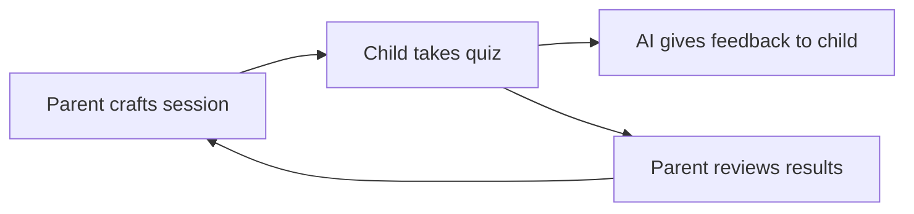
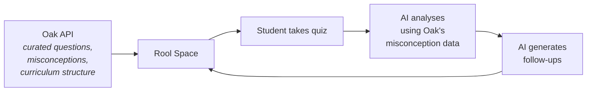
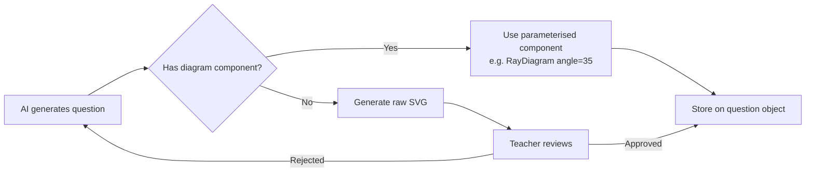

# Vision: AI-Powered Tutoring

## The Core Idea

A quiz-led tutoring app where AI generates questions, students answer them, and AI provides personalised feedback targeting their specific mistakes. The key is the **adaptive loop** — not a static quiz, but an ongoing cycle that gets smarter about what each student needs.

This was prototyped as a single-file React app (Claude Web artifact) for KS3 Physics. It worked surprisingly well — three iterations produced a polished, adaptive quiz with SVG diagrams and personalised LLM feedback. The question is whether this can become a real product.

## What Exists Today

- Two standalone HTML quiz files (Round 1: broad diagnostic, Round 2: targeted revision)
- 20 hand-curated questions per round with MC, T/F, fill-in-blank, and diagram-based types
- SVG diagrams (ray diagrams, wave traces, oscilloscope traces, refraction)
- AI feedback at the end via Anthropic API (analyses specific wrong answers)
- A fresh Rool Spaces + Svelte 5 project scaffold (auth, chat, objects panel)

## User Scenarios

### Scenario 1: Parent tutoring their child (the origin story)

A parent wants to help their kid revise for a test. They don't want to spend hours making questions. They tell the AI "my child is studying KS3 waves" and get a quiz in seconds.

**Rool value**: Persistence. The child's history lives in a space — next week, the AI knows what they struggled with last time.

**Risk**: Overkill. A Claude Web conversation might be simpler for a one-off.

**Design tension**: There are two valid mental models for how this scenario works. See [Two Mental Models](#two-mental-models-for-the-tutoring-loop) below.

### Scenario 2: Freelance tutors building question banks

Tutors who work with multiple students want a shared, growing library of vetted questions. They author via AI, review/approve, and assign quizzes to students.

**Rool value**: Multi-user spaces, AI-embedded authoring, reactive collections.

**Risk**: This is a CMS. The question is whether Rool's model fits better than a traditional database + admin panel.

### Scenario 3: School SaaS (long-term)

Teachers subscribe, manage classes, assign quizzes, track progress across students.

**Rool value**: Auth, spaces-per-class, real-time collaboration.

**Risk**: Needs billing, admin, rostering, reporting — none of which Rool provides. This is a product, not an app.

## Two Mental Models for the Tutoring Loop

Iteration 1 revealed a fundamental design question: **who drives the loop?** Both models below are valid. The architecture must not commit to one prematurely.

### Model A: AI-driven adaptive loop

The AI is autonomous. It generates quizzes, analyses mistakes, and creates targeted follow-ups. The parent sets the initial direction; the AI iterates from there. Topic selection could live on the quiz screen. A question bank accumulates over time.

**User stories**:

- _As a student, I want to log in and get a quiz designed for my weak areas, so I can improve without waiting for someone to make it._
- _As a tutor, I want to add general questions useful across students, so they each get a personalised experience._

**Implication**: The AI has agency. It decides what comes next. The parent/tutor is a curator, not a director.

### Model B: Parent-driven deliberate iteration

The parent drives every cycle. They talk to the AI to craft a specific quiz for a specific session. The child takes it in a **safe space** — with AI feedback that's encouraging and non-judgmental. The parent reviews results and consciously designs the next round.

**User stories**:

- _As a parent, I want to create a targeted learning experience for my child based on their current needs, so they learn the right material at the right time._
- _As a child, I want to take a quiz and talk to a helpful AI, so I can learn without fear of getting things wrong in front of my parent._

**Implication**: The parent has agency. The AI is a tool in the parent's hands. Each quiz is a deliberate act, not an automated output. The emotional design matters — the child's space is separate from the parent's judgment.

### Why this matters

The two models lead to different UI decisions:

| Decision            | Model A (AI-driven)                         | Model B (Parent-driven)                       |
| ------------------- | ------------------------------------------- | --------------------------------------------- |
| Who picks topics?   | AI / topic selector on quiz screen          | Parent, via chat                              |
| Quiz grouping?      | Question bank, filtered by topic/difficulty | Each chat session = one quiz batch            |
| Student's AI access | Feedback only (post-quiz)                   | Full conversation (learning companion)        |
| Review workflow     | Optional (AI self-corrects)                 | Essential (parent reviews before child sees)  |
| Iteration trigger   | Automatic after results                     | Parent returns to chat and directs next round |

Both models work with Rool. Both scale from Scenario 1 to Scenarios 2-3. The right answer will come from real usage — which is why iteration 1 was built without committing to either.

**First real test**: A child scored 15/16 on a Chemistry quiz (bonding & compounds) generated entirely through parent-AI dialogue. The parent-driven model felt natural for this session.

## Oak National Academy Open API

Oak National Academy provides a free open API (`open-api.thenational.academy/api/v0`) covering the entire UK national curriculum. API key required (not yet obtained). This is potentially transformative for the tutoring app.

### What Oak provides

- **Full curriculum hierarchy**: Subjects → Key Stages → Sequences → Units → Lessons. "Year 8, Light and Sound" maps directly to an Oak sequence — no need for the parent to describe topics freehand.
- **Quiz questions per lesson**: Every lesson has a `starterQuiz` (prior knowledge) and `exitQuiz` (lesson outcomes). These are professionally authored, curriculum-aligned questions with misconception-aware distractors.
- **Four question types**: `multiple-choice`, `short-answer`, `match`, `order`. Our app currently supports `mc`, `tf`, `fill` — Oak adds match and order, and their short-answer maps roughly to our fill.
- **Structured misconception data**: `GET /lessons/{lesson}/summary` returns anticipated misconceptions with teacher responses. This is the quality layer we currently rely on the system instruction to produce.
- **Keywords with definitions**: Per-lesson vocabulary lists the AI could use to generate better questions or validate its output.
- **Lesson search**: By title (`/search/lessons`) and by transcript content (`/search/transcripts`).

### Oak's image model

Every question type has an optional `questionImage` — a URL to a hosted raster image with width, height, alt text, and attribution. Multiple-choice answers can also be images (not just text). This is simple: no SVG generation, no diagram components — just `` tags referencing hosted assets.

However, **image coverage is inconsistent**. Testing Oak's lesson plan generator for Chemistry revealed it was largely void of images, suggesting "which Google Image searches one might do" instead. The API schema supports images, but many lessons simply don't have them. This is the same content gap we identified — diagrams are a content problem, not a technical one.

### How Oak changes the picture

| Current approach                        | With Oak                                                                |
| --------------------------------------- | ----------------------------------------------------------------------- |
| AI generates questions from scratch     | Oak provides curated baseline; AI personalises and generates follow-ups |
| System instruction is the only QA layer | Oak questions are expert-reviewed — QA is built in                      |
| Question quality depends entirely on AI | Misconception data from Oak grounds the AI's distractors                |
| Subject scope = whatever the AI knows   | Subject scope = the national curriculum                                 |
| Parent describes topics in chat         | Parent could browse/search Oak's curriculum structure                   |
| Image/diagram strategy undecided        | For Oak-sourced questions, images come free via URL (where they exist)  |

### What Oak doesn't solve

- **AI-generated follow-ups still need QA** — Oak provides the baseline, but personalised follow-ups are AI-generated.
- **Image gap persists** for AI-generated content — Oak's approach (host pre-made images) doesn't help when the AI is creating new questions.
- **Two extra question types** (`match`, `order`) need new UI components in QuestionScreen.
- **API key required** — haven't applied yet. Oak is government-funded so likely accessible for educational use.

### The hybrid model

The most promising approach: use Oak as the **curriculum backbone** and the AI as the **personalisation layer**.

This fits both mental models: in Model A, the AI pulls from Oak automatically; in Model B, the parent browses Oak's curriculum and the AI augments.

## Known Obstacles

### 1. SVG Diagrams

AI can generate SVG, but quality is inconsistent. Coordinates drift, labels overlap. Two approaches:

- **Parameterised components**: Build a library of Svelte diagram components (ray, wave, oscilloscope, refraction, circuit). AI generates parameters, not raw SVG. Reliable but limited to pre-built types.
- **Raw SVG with review gate**: AI generates full SVG, teacher reviews and approves before it's shown to students. Flexible but labour-intensive.

Likely answer: **both**. Component library for common types, raw SVG escape hatch for edge cases. Physics at KS3-KS5 has a finite set of diagram types — probably fewer than 15 covers the vast majority.

### 2. Question Quality

Hand-authored questions have curated distractors, precise acceptance ranges, and tested explanations. AI-generated questions need guardrails:

- Distractors must be plausible (common misconceptions, not random)
- Fill-in-blank needs accept ranges and alternatives
- Explanations must address _why the wrong answer is wrong_, not just state the right answer
- Difficulty must be calibrated to the key stage

Mitigation: strong system instructions with examples, plus a teacher review step for bank questions. On-the-fly coaching can be looser.

### 3. The "Who Reviews" Problem

If the end user is a parent (Scenario 1), there's no teacher to review AI-generated questions. The parent is trusting the AI. This is probably fine for low-stakes revision, but it means the system instruction quality is critical — it's the only QA.

If the end user is a teacher (Scenarios 2-3), the review workflow needs to be lightweight — render the question nicely, let them tweak wording, approve/reject. Not "stare at JSON."

### 4. Subject Scope

The prototype is KS3 Physics. Scaling to other subjects means:

- Different diagram types (biology: cell diagrams, chemistry: atomic structure)
- Different question patterns (language subjects: comprehension, translation)
- Different assessment frameworks (GCSE vs A-Level vs international curricula)

This is a content problem, not a technology problem. The architecture should be subject-agnostic — topics and question schemas shouldn't hardcode physics concepts.

## Strategy

Build Scenario 1 first. One space, one parent, one child. If the authoring and studying both feel good inside Rool, the foundation is right. If it feels clunky compared to chatting with Claude Web, that's a signal.

Then decide whether Scenario 2 or 3 is worth pursuing based on real usage.
